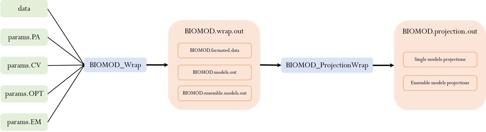

[](https://github.com/biomodhub/biomod3)
[](https://github.com/biomodhub/biomod3/commits/master)

<!-- [](https://cran.r-project.org/package=segclust2d) -->

```{=html}
<!-- 
badge for github version :
badger::badge_github_version("biomodhub/biomod3", "blue") 
-->
```
```{=html}
<style>
.zoom p {
width:800px;
margin-left: auto;
margin-right: auto;
}
.zoom p:hover {
width:1500px;
position: relative;
z-index: 10;
}
</style>
```
::: {align="center"}
<p></img></p>

<b>------------------------------------------------------------<br/>
Toolkit to use with biomod2 package <br/>
------------------------------------------------------------<br/> </b>

<https://biomodhub.github.io/biomod2/>
:::

### <i class="fas fa-tools"></i> Installation

<br/>

-   **Development version**
    [](https://github.com/biomodhub/biomod3)
    from [biomodhub](https://github.com/biomodhub/biomod3) :

``` r
library(devtools)
devtools::install_github("biomodhub/biomod3", dependencies = TRUE)
```

<br/><br/><br/>

<br/><br/>

### <i class="fa-solid fa-image"></i> Graphical abstract

<br/>

::: zoom
<p></img></p>
:::

<br/>
<div align="center">
<b>------------------------------------------------------------<br/>
</div>
<br/>

::: zoom
<p></img></p>
:::

<br/><br/><br/>


### <i class="fa-solid fa-gift"></i> biomod2 wrap

The functions `BIOMOD_Wrap` and `BIOMOD_ProjectionWrap` allows to: 

 - formatted the data and create single and ensemble models for the
former 
 - made the projections for the single and the ensemble models for
the latter 

... in the same function.

<br/><br/><br/>

#### <i class="fa-brands fa-files-pinwheel"></i> MultiSpecies

`MS_FormatingData`, `MS_Modeling`, `MS_EnsembleModeling`,
`MS_Projection` and `MS_EnsembleForecasting` allows to do the same steps
than with `biomod2` with several species in the same time.

<br/><br/><br/>

### <i class="fa-regular fa-gem"></i> Shiny App to help

- `bm_ShinyOptions` is a shiny app to help create customized `BIOMOD.models.options`.
You can adapt your options to your `BIOMOD.formated.data` and the CV table you already have in your environment.

- `helpParams` is made to help with the different `params` list used in `BIOMOD_wrap` and the others
MS functions. 


<br/><br/>

<br/><br/>
